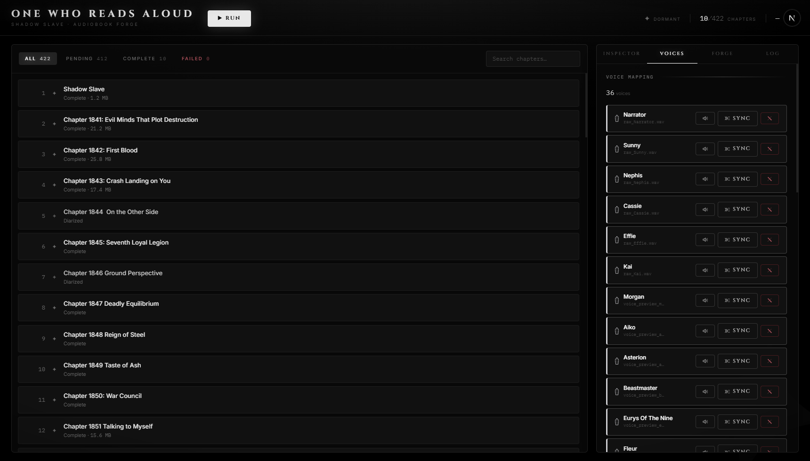
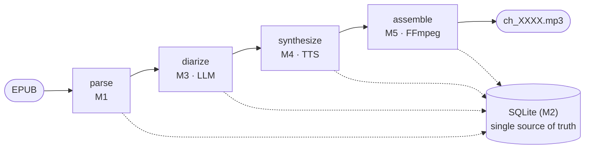

<h1 align="center">One Who Reads Aloud</h1>

<p align="center"><em>Turns the Shadow Slave web novel into a multi-voice audiobook — every character cloned, every line acted.</em></p>

<p align="center">
  
  
  
  
  
</p>

A local pipeline that turns the *Shadow Slave* web novel into a multi-voice audiobook. Feed it an EPUB and it produces chapter MP3s where every character speaks in their own cloned voice, and every line is delivered with an emotion chosen by an LLM. The whole thing runs on a single consumer GPU — no APIs, no cloud, nothing leaves your machine.



## How it works

Each chapter moves through four stages, orchestrated by a FastAPI backend and monitored live from a Next.js UI over SSE:



1. **Parse** — chapters are extracted from the EPUB and seeded into SQLite.
2. **Diarize** — a local Qwen3-14B (GGUF, llama.cpp) assigns a speaker and an emotion to every line. This is a two-pass design: a deterministic Python segmenter splits the text into dialogue / system-notification / prose segments, then the LLM only emits labels for them, locked to a GBNF grammar. The model never reproduces the chapter text, so it physically cannot drop or mangle words. (The first version asked the LLM to echo everything back as JSON. It lost sentences, leaked JSON fragments into spoken audio, and was four times slower. See [docs/design/llm-diarizer-v2.md](docs/design/llm-diarizer-v2.md) for the post-mortem and design.)
3. **Synthesize** — IndexTTS2 clones each character's voice from a single reference clip. Emotion doesn't need separate clips: the LLM's emotion tag is mapped to IndexTTS2's 8-dim emotion vector (`happy, angry, sad, afraid, disgust, melancholic, surprised, calm`) and passed per line, so one clean neutral recording per character is enough.
4. **Assemble** — per-line WAVs are concatenated into a chapter MP3 with FFmpeg. CPU only.

Chapters track their own status (`pending → diarized → tts_done → assembled → complete`), so a stopped or crashed run resumes exactly where it left off — a chapter that already has diarization skips straight to TTS.

### The 12 GB problem

The LLM needs ~9 GB of VRAM and IndexTTS2 needs ~8 GB. The machine has 12. They can never be loaded at the same time, so the orchestrator runs them strictly sequentially: diarize a chapter, unload the LLM, poll `nvidia-smi` until usage actually drops below 1 GB (CUDA frees memory lazily), then load the TTS engine. Both models live inside context managers that guarantee unload on exit, even on error.

## Requirements

- Windows (the launcher scripts are PowerShell; the backend itself is portable)
- Python 3.11, Node 18+
- FFmpeg in `PATH`
- An NVIDIA GPU with ~12 GB VRAM
- ~20 GB of disk for model weights

## Setup

```powershell
# Python deps
pip install -r requirements.txt

# llama-cpp-python with CUDA (the PyPI default is CPU-only)
pip install llama-cpp-python --extra-index-url https://abetlen.github.io/llama-cpp-python/whl/cu124 --no-cache-dir

# IndexTTS2 — installed from source, weights from HF (~8 GB)
git clone https://github.com/index-tts/index-tts
cd index-tts; pip install -e .; cd ..
hf download IndexTeam/IndexTTS-2 --local-dir index-tts/checkpoints

# Diarization model (~9 GB)
hf download Qwen/Qwen3-14B-GGUF Qwen3-14B-Q4_K_M.gguf --local-dir models

# Frontend
cd ui; npm install; cd ..
```

On Windows, `deepspeed` usually fails to build — that's fine, the TTS engine runs without it.

## Running

```powershell
.\start.ps1
```

This starts the backend (port 8000) and the UI (port 3000) in separate windows and opens the browser. From the UI: create a project from your EPUB, map characters to voice reference clips (one clean ~10 s neutral clip per character — no transcript needed, IndexTTS2 clones from audio alone), and start the pipeline. Assembled MP3s land in `data/output/`.

Backend and frontend can also be run separately:

```powershell
cd src; python -m uvicorn api:app --port 8000 --reload
cd ui;  npm run dev
```

## Tests

Nothing in the test suite needs a GPU — the LLM call and the synthesizer are monkeypatched.

```powershell
python tests/test_llm_director.py
python tests/test_epub_parser.py
python tests/test_api.py

cd ui
npm test
npm run typecheck
```

## A note on the content

This repo contains code only — no novel text, no audio, no model weights. You supply your own EPUB and voice clips. *Shadow Slave* is the work of Guiltythree; go read it on [Webnovel](https://www.webnovel.com/book/shadow-slave_21880912006091605).

## License

MIT
